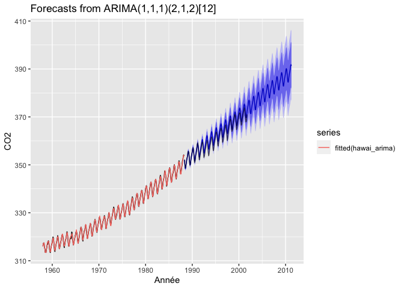

Travail 5 : Séries temporelles et reproductibilité
================
Joannie D’Amours
20/07/2020

Les données du fichier hawai.csv comprennent les moyennes des mesures
mensuelles de CO2 atmosphérique en ppm-volume collectées au Mauna Loa
Observatory à Hawaii de mars 1958 à décembre 2001, inclusivement.
Votre travail consiste à:  
1\. Créer une série temporelle du CO2 à partir des données de
hawai.csv;  
2\. Séparer la série en parties d’entraînement (environ 70% des
données) et en partie test;  
3\. Créer un modèle prévisionnel sur les données d’entraînement,
puis projeter la prévision de CO2 atmosphérique pour comparer aux
données test;  
4\. Effectuer une analyse des résidus;  
5\. Commenter: le modèle est-il fiable? Comment pourrait-il être
amélioré?  
Vous devez me remettre un lien vers un répertoire git de votre choix
(GitHub, GitLab, etc.) comprenant un code reproductible de votre
démarche en format R-markdown.

Nous utiliserons les
    modules:

``` r
library("tidyverse")
```

    ## ── Attaching packages ─────────────────────────────────────── tidyverse 1.3.0 ──

    ## ✓ ggplot2 3.3.2     ✓ purrr   0.3.4
    ## ✓ tibble  3.0.1     ✓ dplyr   1.0.0
    ## ✓ tidyr   1.1.0     ✓ stringr 1.4.0
    ## ✓ readr   1.3.1     ✓ forcats 0.4.0

    ## Warning: package 'ggplot2' was built under R version 3.6.2

    ## Warning: package 'tibble' was built under R version 3.6.2

    ## Warning: package 'tidyr' was built under R version 3.6.2

    ## Warning: package 'purrr' was built under R version 3.6.2

    ## Warning: package 'dplyr' was built under R version 3.6.2

    ## ── Conflicts ────────────────────────────────────────── tidyverse_conflicts() ──
    ## x dplyr::filter() masks stats::filter()
    ## x dplyr::lag()    masks stats::lag()

``` r
library("lubridate")
```

    ## 
    ## Attaching package: 'lubridate'

    ## The following object is masked from 'package:base':
    ## 
    ##     date

``` r
library("forecast")
```

    ## Warning: package 'forecast' was built under R version 3.6.2

    ## Registered S3 method overwritten by 'quantmod':
    ##   method            from
    ##   as.zoo.data.frame zoo

``` r
library("cowplot") # fonction cowplot::plot_grid() pour arranger différents graphiques ggplot2 en une grille.
```

    ## 
    ## ********************************************************

    ## Note: As of version 1.0.0, cowplot does not change the

    ##   default ggplot2 theme anymore. To recover the previous

    ##   behavior, execute:
    ##   theme_set(theme_cowplot())

    ## ********************************************************

    ## 
    ## Attaching package: 'cowplot'

    ## The following object is masked from 'package:lubridate':
    ## 
    ##     stamp

## Explorer le tableau de données d’Hawai:

``` r
hawai <- read_csv(file = "hawai.csv")
```

    ## Parsed with column specification:
    ## cols(
    ##   time = col_double(),
    ##   CO2 = col_double()
    ## )

``` r
glimpse(hawai)
```

    ## Rows: 526
    ## Columns: 2
    ## $ time <dbl> 1958.167, 1958.250, 1958.333, 1958.417, 1958.500, 1958.583,…
    ## $ CO2  <dbl> 316.1000, 317.2000, 317.4333, 317.4333, 315.6250, 314.9500,…

Nous remarquons que le format des date est en décimal. Convertissons les
données de temps en format date (Year-Month-Day-Hours-Minutes-Seconds).

``` r
hawai <- hawai %>%
  mutate(Date = date_decimal(time, tz = "UTC"))
```

Vérifier quel est le nouveau format:

``` r
hawai %>% pull(Date) %>% class()
```

    ## [1] "POSIXct" "POSIXt"

Voici le nouveau tableau avec des colonnes années et mois ajoutées:

``` r
hawai %>%
  mutate(Year = Date %>% year(),
         Month = Date %>% month())
```

    ## # A tibble: 526 x 5
    ##     time   CO2 Date                 Year Month
    ##    <dbl> <dbl> <dttm>              <dbl> <dbl>
    ##  1 1958.  316. 1958-03-02 20:00:01  1958     3
    ##  2 1958.  317. 1958-04-02 06:00:00  1958     4
    ##  3 1958.  317. 1958-05-02 16:00:00  1958     5
    ##  4 1958.  317. 1958-06-02 02:00:01  1958     6
    ##  5 1958.  316. 1958-07-02 12:00:00  1958     7
    ##  6 1959.  315. 1958-08-01 22:00:00  1958     8
    ##  7 1959.  314. 1958-09-01 08:00:01  1958     9
    ##  8 1959.  314. 1958-10-01 18:00:00  1958    10
    ##  9 1959.  313. 1958-11-01 04:00:00  1958    11
    ## 10 1959.  315. 1958-12-01 14:00:01  1958    12
    ## # … with 516 more rows

## 1\. Créer une série temporelle de type `ts`

``` r
hawai_ts <- ts(hawai %>% dplyr::select(-time, -Date),
               start = c(hawai$Date[1] %>% year(), 1), # dans le vecteur date, prendre l'unité de départ, l'année, et l'unité saisonnière débute à 1
               frequency = 12) # fréquence des données mesurées du tableau dans l'unité de départ (données mensuelles = 12 par années)
```

Explorons graphiquement les données de temps et de CO2 émis:

``` r
autoplot(hawai_ts) + ggtitle("Hawai: Série temporelle")
```

<!-- -->

On observe une forte tendance d’augmentation de la concentration du CO2
ainsi qu’une saisonnalité (dans le sens de cycles) dans les
concentrations mesurées au fil des années. Il semble qu’un cycle dure
une année.

### Autocorrélation

Les graphiques suivants montrent qu’il y a une structure dans les
données. Le graphique d’autocorrélation montre la présence d’une
tendance, puisque les valeurs des coefficients d’autocorrélation sont
plus élevées pour les plus petits lags et diminuent lentement au fur et
à mesure que les lags augmentent. Aussi, on remarque une saisonnalité
par les hausses des lags aux multiples de la fréquence saisonnière (à
chaque 12 mois). Il y a une significativité dans les corrélations
observées tel que représenté par les lignes pointillées bleues du
graphique. Le lag plot montre lui aussi une forte structure dans les
données.

``` r
plot_grid(ggAcf(hawai_ts) + ggtitle("Hawai: Autocorrélation"),
          gglagplot(hawai_ts) + ggtitle("Hawai: Lag plot"),
          ncol =2)
```

<!-- -->

Le test de Ljung-Box permet quant à lui de tester si la série temporelle
entière peut être différenciée d’un bruit blanc.

``` r
Box.test(hawai_ts, lag = 12, type = "Ljung-Box")
```

    ## 
    ##  Box-Ljung test
    ## 
    ## data:  hawai_ts
    ## X-squared = 5824.6, df = 12, p-value < 2.2e-16

``` r
# La probabilité que la série soit un bruit blanc est presque nulle.
```

## 2\. Séparer la série en parties d’entraînement et en partie test

La partie d’entraînement incluera environ 70% des données et la partie
test en incluera 30%.

``` r
hawai_ts_train <- window(hawai_ts, start = 1958, end = 1988.25999)
hawai_ts_test <- window(hawai_ts, start = 1988.26, end = 2001.999)
```

    ## Warning in window.default(x, ...): 'end' value not changed

## 3\. Créer un modèle prévisionnel sur les données d’entraînement, puis projeter la prévision de CO2 atmosphérique pour comparer aux données test

``` r
hawai_arima <- hawai_ts_train %>% auto.arima() # créer un modèle prévisionnel sur les données d'entraînement
hawai_arima %>%
  forecast(h = 276) %>% # projeter la prévision de CO2 sur la durée des données test et même au-delà de ces données
  autoplot() +
  autolayer(fitted(hawai_arima)) +
  autolayer(hawai_ts_test, color = rgb(0, 0, 0, 0.6)) + # afficher les données test pour comparer les prévisions du modèle avec les valeurs réelles mesurées
  labs(x = "Année", y = "CO2")
```

<!-- -->

Avec la fonction `auto.arima`, les paramètres (p,d,q) sont optimisés et
la composante saisonnière est automatiquement détectée et optimisée avec
des paramètres (P,D,Q) que l’on peut voir dans la 2e parenthèse affichée
dans le titre du graphique. Ces valeurs correspondent au nombre de
données utilisées pour l’évaluation du paramètre. Ces informations sont
suivies de l’ordre “m” nous informant sur le cycle saisonnier, ici
\[12\], ce qui correspond au nombre d’évènements par unité temporelle.

## 4\. Effectuer une analyse des résidus

``` r
checkresiduals(hawai_arima)
```

<!-- -->

    ## 
    ##  Ljung-Box test
    ## 
    ## data:  Residuals from ARIMA(1,1,1)(2,1,2)[12]
    ## Q* = 20.254, df = 18, p-value = 0.3187
    ## 
    ## Model df: 6.   Total lags used: 24

``` r
# Vérifier la distribution des résidus avec un test de Shapiro
shapiro.test(residuals(hawai_arima)) # non-normal si p-value < seuil (0.05)
```

    ## 
    ##  Shapiro-Wilk normality test
    ## 
    ## data:  residuals(hawai_arima)
    ## W = 0.98875, p-value = 0.006606

## 5\. Commentaires sur la fiabilité du modèle et améliorations possibles

``` r
summary(hawai_arima)
```

    ## Series: . 
    ## ARIMA(1,1,1)(2,1,2)[12] 
    ## 
    ## Coefficients:
    ##          ar1      ma1     sar1     sar2     sma1     sma2
    ##       0.3624  -0.7327  -0.2256  -0.1724  -0.6013  -0.1484
    ## s.e.  0.0981   0.0714   0.3189   0.0681   0.3212   0.2771
    ## 
    ## sigma^2 estimated as 0.1161:  log likelihood=-119.16
    ## AIC=252.32   AICc=252.65   BIC=279.35
    ## 
    ## Training set error measures:
    ##                      ME      RMSE       MAE         MPE       MAPE
    ## Training set 0.03070767 0.3317709 0.2550959 0.009004358 0.07745403
    ##                   MASE        ACF1
    ## Training set 0.2112819 -0.01394558

Sur le graphique d’autocorrélation illustré au point 4, les résidus
ressemblent presque à une série de “bruit blanc”, c’est-à-dire qu’ils ne
montrent pratiquement pas d’autocorrélation, ou plus précisément
celle-ci se rapproche de zéro, puisque les résidus devraient réprésenter
une variation au hasard. Par contre, on observe une barre qui sort de
l’intervalle de confiance: une corrélation systématique de certains
résidus est apparente, ce qui pourrait être amélioré dans le modèle. De
plus, on remarque que les coefficients de corrélation négatifs ont une
valeur plus élevée, puisque les barres sous zéro sont plus longues. Dans
l’histogramme des résidus, à première vue, les résidus semblent
distribués normalement. Le test de Shapiro nous indique cependant que
les résidus ne suivent pas une distribution normale. Cependant, il est à
noter que ce test est particulièrement sévère. Lorsqu’on vérifie les
résultats du test Ljung-Box, la probabilité que les résidus fassent
partie d’un échantillon provenant d’une population de bruit blanc est
assez élevée avec un p-value de 0.3725. Selon ce test, il ne semble donc
pas y avoir de structure évidente dans les résidus et notre modèle
serait assez valable. Les intervalles de confiance de 80% et de 95% du
modèle recouvrent assez bien les données test, tel qu’observé dans le
graphique du modèle prévisionnel généré par les données d’entraînement.
Les prévisions des concentrations en CO2 dans le temps représentent
assez bien des données test. On peut conclure que notre modèle est assez
fiable malgré les petites améliorations nécessaires pour diminuer
l’autocorrélation.
